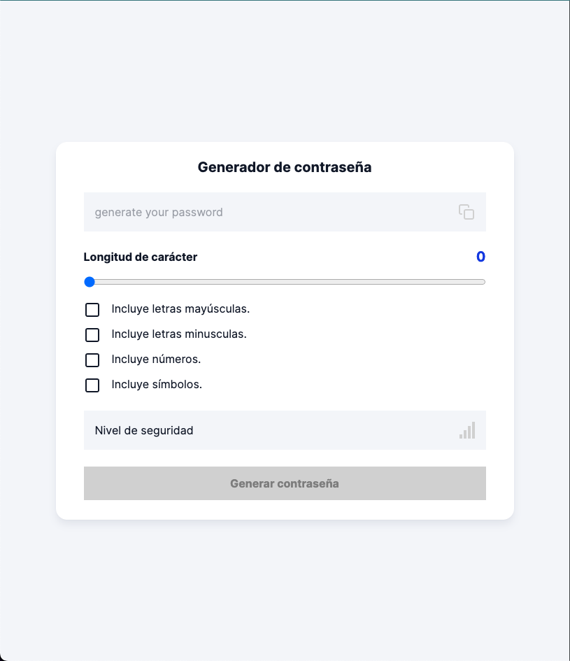
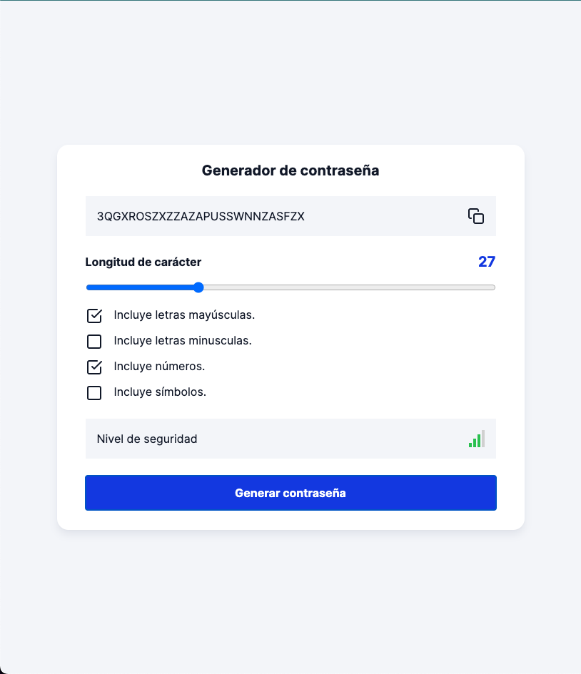
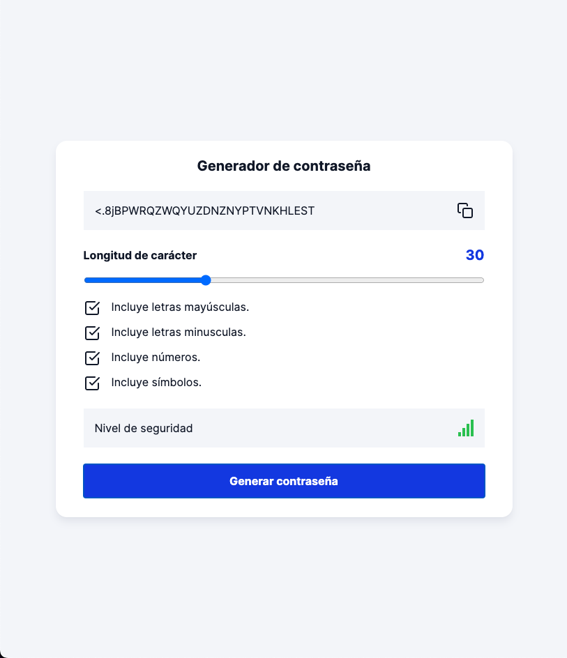
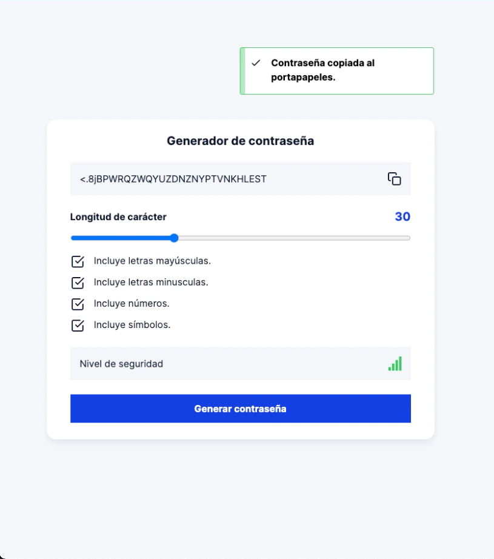
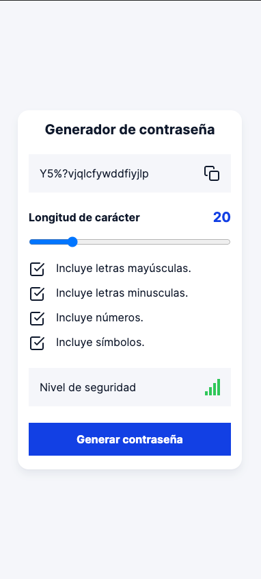
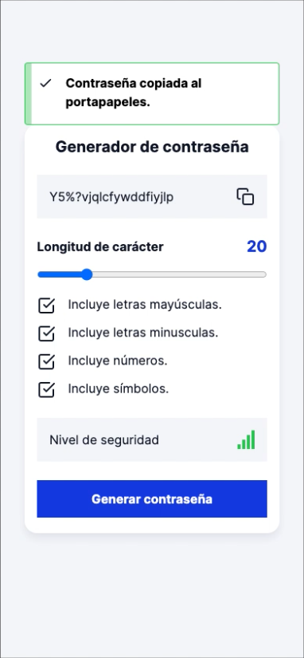

<h1 align="center">
  <p align="center">Password generator</p>
</h1>

## Introduction

Este generador de contraseñas fue desarrollado en React con Vite.js. Utiliza una serie de parámetros para crear aleatoriamente una cadena de caracteres que se puede copiar al portapapeles. Después de copiar el texto, el usuario recibirá una alerta de confirmación. Además, el sistema muestra el nivel de seguridad de la cadena de texto generada.

Acontinucación se presentan los pasos para ejecutar el proyecto en local. Si no deseas descargar el proyecto tambien puedes visitarlo en la url: 

## Installation

1. Clonar el repositorio
2. Entrar a la carpera del proyecto e instalar las dependencias del proyecto ejecutando el siguiente comando:
```bash
npm install
```
3. Una vez finalizada la instalación de dependecias podemos levantar el proyecto con el comando siguiente: 
```bash
npm run dev
```
Como resultado podremos acceder al proyecto en la ruta:  http://localhost:5173/

## Screen shots





